# Detailed Architecture Diagrams

## 1. High-Level System Architecture

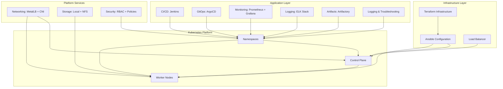

---

## 2. Infrastructure Provisioning Block

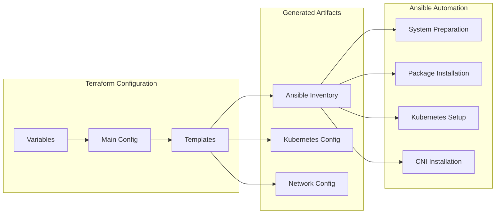

---

## 3. Kubernetes Cluster Architecture

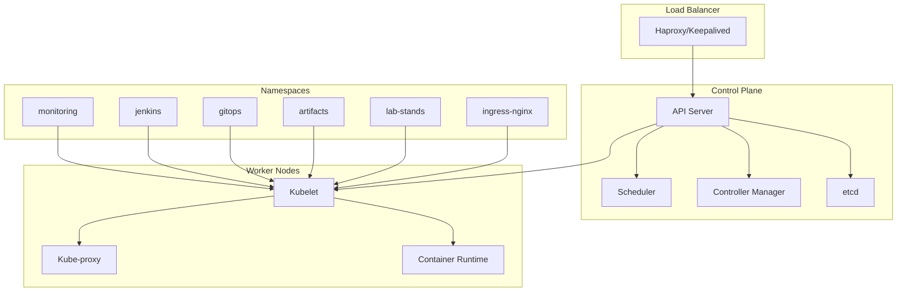

---

## 4. Networking Architecture

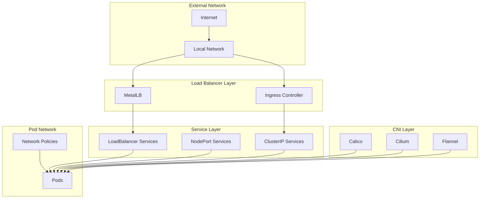

---

## 5. Storage Architecture

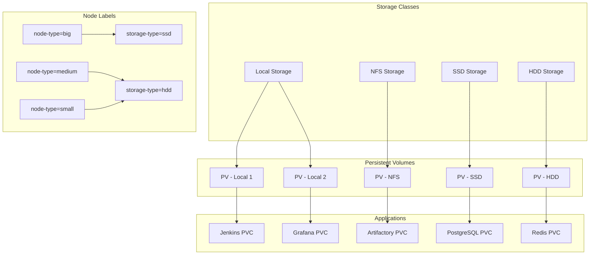

---

## 6. CI/CD Pipeline Architecture

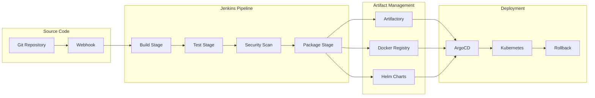

---

## 7. Monitoring & Observability Architecture

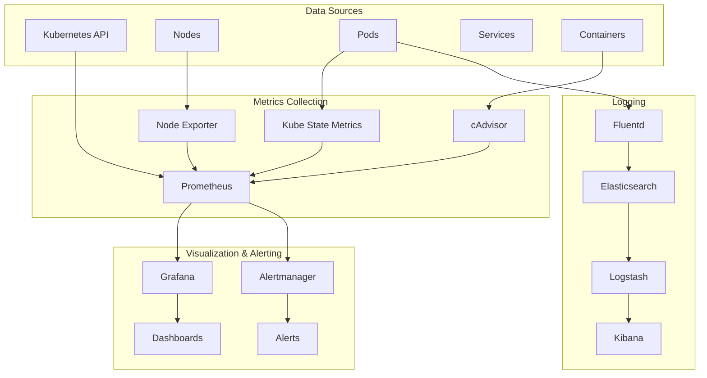

---

## 8. Security Architecture

```mermaid
graph TB
    subgraph "Authentication & Authorization"
        RBAC[RBAC]
        SA[Service Accounts]
        TOKENS[Tokens]
    end
    
    subgraph "Network Security"
        NETPOL[Network Policies]
        INGRESS_POLICY[Ingress Policies]
        EGRESS_POLICY[Egress Policies]
    end
    
    subgraph "Pod Security"
        PSP[Pod Security Policies]
        SECURITY_CONTEXT[Security Context]
        CAPABILITIES[Capabilities]
    end
    
    subgraph "Secrets Management"
        K8S_SECRETS[Kubernetes Secrets]
        EXTERNAL_SECRETS[External Secrets Operator]
        VAULT[Hashicorp Vault]
    end
    
    subgraph "Compliance"
        AUDIT[Audit Logging]
        SCANNING[Security Scanning]
        POLICY[Policy Enforcement]
    end
    
    RBAC --> SA
    SA --> TOKENS
    NETPOL --> INGRESS_POLICY
    NETPOL --> EGRESS_POLICY
    PSP --> SECURITY_CONTEXT
    SECURITY_CONTEXT --> CAPABILITIES
    K8S_SECRETS --> EXTERNAL_SECRETS
    EXTERNAL_SECRETS --> VAULT
    AUDIT --> POLICY
    SCANNING --> POLICY
```

---

## 9. GitOps Workflow Architecture

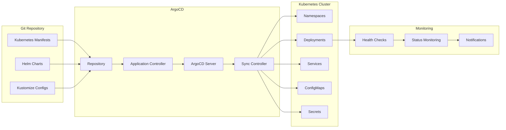

---

## 10. Node Architecture & Resource Allocation

```mermaid
graph TB
    subgraph "Control Plane Nodes"
        CP1[CP-01<br/>High Performance]
        CP2[CP-02<br/>High Performance]
        CP3[CP-03<br/>High Performance]
    end
    
    subgraph "Worker Nodes - Big"
        WB1[Worker-Big-01<br/>SSD Storage]
        WB2[Worker-Big-02<br/>SSD Storage]
        WB3[Worker-Big-03<br/>SSD Storage]
    end
    
    subgraph "Worker Nodes - Medium"
        WM1[Worker-Medium-01<br/>HDD Storage]
        WM2[Worker-Medium-02<br/>HDD Storage]
        WM3[Worker-Medium-03<br/>HDD Storage]
    end
    
    subgraph "Worker Nodes - Small"
        WS1[Worker-Small-01<br/>HDD Storage]
        WS2[Worker-Small-02<br/>HDD Storage]
        WS3[Worker-Small-03<br/>HDD Storage]
    end
    
    subgraph "Workload Distribution"
        JENKINS[Jenkins<br/>node-type=big]
        MONITORING[Monitoring<br/>node-type=big]
        ARTIFACTORY[Artifactory<br/>node-type=big]
        LAB_APPS[Lab Apps<br/>node-type=medium]
        INGRESS[Ingress<br/>node-type=medium]
        UTILS[Utilities<br/>node-type=small]
    end
    
    CP1 --> JENKINS
    CP2 --> MONITORING
    CP3 --> ARTIFACTORY
    WB1 --> JENKINS
    WB2 --> MONITORING
    WB3 --> ARTIFACTORY
    WM1 --> LAB_APPS
    WM2 --> INGRESS
    WM3 --> LAB_APPS
    WS1 --> UTILS
    WS2 --> UTILS
    WS3 --> UTILS
```

---

## 11. Deployment Flow Architecture

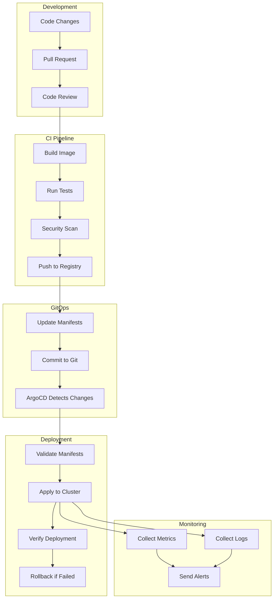

---

## 12. Disaster Recovery Architecture

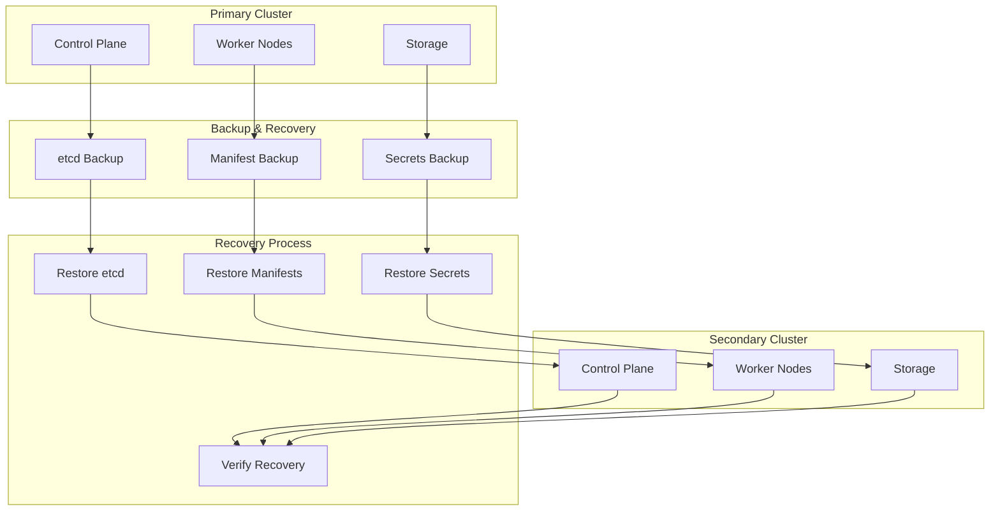

---

## 13. Logging and Troubleshooting Architecture

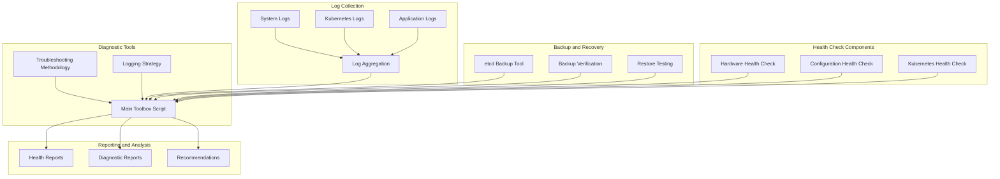

---

## Summary

These detailed diagrams provide a comprehensive view of:

1. **High-Level System Architecture** - Overall system design
2. **Infrastructure Provisioning** - Terraform and Ansible automation
3. **Kubernetes Cluster** - Control plane and worker node architecture
4. **Networking** - CNI, MetalLB, and service mesh
5. **Storage** - Persistent volumes and storage classes
6. **CI/CD Pipeline** - Jenkins and ArgoCD integration
7. **Monitoring & Observability** - Prometheus, Grafana, and ELK stack
8. **Security** - RBAC, network policies, and secrets management
9. **GitOps Workflow** - ArgoCD application management
10. **Node Architecture** - Resource allocation and workload distribution
11. **Deployment Flow** - End-to-end deployment process
12. **Disaster Recovery** - Backup and recovery procedures
13. **Logging and Troubleshooting** - Health checks, diagnostics, and maintenance tools

Each diagram shows the relationships between components and the data flow within the system, providing a complete understanding of the bare metal Kubernetes lab architecture. 