# Project Architecture Overview

## High-Level Architecture Diagram

```mermaid
flowchart TD
  subgraph Infrastructure Provisioning
    TF[Terraform]
    TFV[Terraform Variables]
    TF --> TFV
    TF --> INV[Ansible Inventory Template]
  end

  subgraph Configuration Management
    ANS[Ansible]
    PREP[Prepare Systems]
    INST[Install Kubernetes]
    ANS --> PREP
    ANS --> INST
    INV --> ANS
  end

  subgraph Kubernetes Cluster
    CP[Control Plane Nodes]
    WK[Worker Nodes]
    LB[Load Balancer]
    NS[Namespaces]
    CP -.-> LB
    WK -.-> LB
    NS --> CP
    NS --> WK
  end

  subgraph Platform Services
    METALLB[MetalLB]
    CNI[CNI: Calico/Cilium/Flannel]
    CSI[Storage: Local/NFS]
    METALLB --> LB
    CNI --> CP
    CNI --> WK
    CSI --> WK
  end

  subgraph CI/CD & GitOps
    JENKINS[Jenkins]
    ARGOCD[ArgoCD]
    JENKINS --> NS
    ARGOCD --> NS
  end

  subgraph Monitoring & Logging
    PROM[Prometheus]
    GRAF[Grafana]
    ELK[ELK Stack]
    PROM --> NS
    GRAF --> NS
    ELK --> NS
  end

  subgraph Artifact Management
    ARTIFACT[Artifactory]
    ARTIFACT --> NS
  end

  subgraph Security
    NETPOL[Network Policies]
    PSP[Pod Security Policies]
    NETPOL --> NS
    PSP --> NS
  end

  subgraph Secrets Management
    K8SSEC[Kubernetes Secrets]
    EXSEC[External Secrets Operator]
    K8SSEC --> NS
    EXSEC --> NS
  end

  TF --> ANS
  ANS --> CP
  ANS --> WK
  ANS --> LB
  INV --> ANS
  NS --> JENKINS
  NS --> ARGOCD
  NS --> PROM
  NS --> GRAF
  NS --> ELK
  NS --> ARTIFACT
  NS --> NETPOL
  NS --> PSP
  NS --> K8SSEC
  NS --> EXSEC
```

---

## Module and Block Descriptions

### 1. Infrastructure Provisioning
- **Terraform**: Automates provisioning of VMs, networks, and base infrastructure for the Kubernetes cluster.
- **Terraform Variables**: Centralized configuration for network, node IPs, versions, etc.
- **Ansible Inventory Template**: Dynamically generated inventory for Ansible based on Terraform outputs.

### 2. Configuration Management
- **Ansible**: Automates OS preparation, package installation, and Kubernetes setup on all nodes.
- **Prepare Systems**: Updates, configures, and secures all nodes for Kubernetes.
- **Install Kubernetes**: Installs kubeadm, kubelet, and configures the cluster.

### 3. Kubernetes Cluster
- **Control Plane Nodes**: Run Kubernetes API server, scheduler, controller-manager, etcd.
- **Worker Nodes**: Run user workloads (pods, services).
- **Load Balancer**: Distributes API and service traffic.
- **Namespaces**: Logical separation for monitoring, CI/CD, GitOps, artifacts, lab-stands, ingress, etc.

### 4. Platform Services
- **MetalLB**: Provides LoadBalancer services for bare metal clusters.
- **CNI (Calico/Cilium/Flannel)**: Container networking plugins for pod communication and network policies.
- **CSI (Local/NFS Storage)**: Storage integration for persistent volumes.

### 5. CI/CD & GitOps
- **Jenkins**: CI/CD automation for building, testing, and deploying applications.
- **ArgoCD**: GitOps tool for declarative continuous delivery to Kubernetes.

### 6. Monitoring & Logging
- **Prometheus**: Metrics collection and alerting.
- **Grafana**: Visualization and dashboards.
- **ELK Stack**: Centralized logging (Elasticsearch, Logstash, Kibana).

### 7. Artifact Management
- **Artifactory**: Repository for container images, Helm charts, and other build artifacts.

### 8. Security
- **Network Policies**: Restrict pod-to-pod communication.
- **Pod Security Policies**: Enforce security standards for pod execution.

### 9. Secrets Management
- **Kubernetes Secrets**: Native secret storage for sensitive data.
- **External Secrets Operator**: Integrates with external secret stores (e.g., Vault).

---

This architecture ensures modularity, scalability, and security for a bare metal Kubernetes lab environment. Each block can be extended or replaced as needed for production or educational use. 